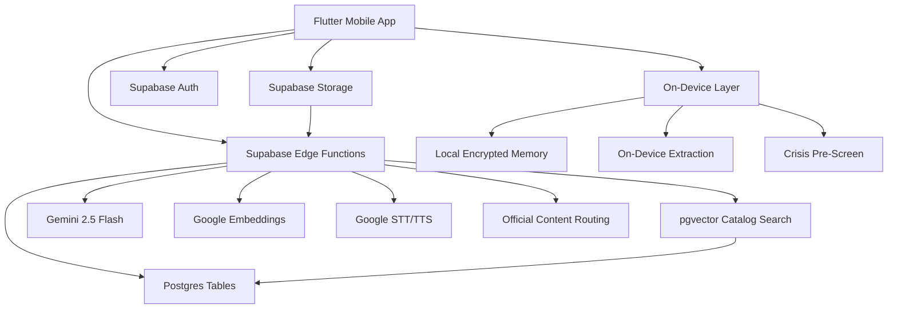

# Sayved Sharp MVP - Technical Architecture Document

## 1. Product Intent

Sayved is a mobile-first Christian formation engine. The user is not entering separate pastor chat rooms; they are entering one continuous conversation with Sayved's own voice, the Director. The Director can draw from Scripture, the user's Memory, followed teachers, Council voices, and source-linked sermons without ever impersonating anyone.

The narrow MVP is the real production architecture with a deliberately small content set: four focused pastor/teacher slots. The named launch set includes Prophet T.B. Joshua, Pastor Chris Oyakhilome, Pastor E.A. Adeboye, and Archbishop Benson Idahosa. Until licenses or estate permissions are secured, these teachers must run in Phase A librarian mode: official links, public feeds, brief attributed quotes, request signals, and no deep transcript RAG.

## 2. Governing Product Rules

- Sayved quotes everyone and voices no one, living or dead.
- The Director is the only generated speaker.
- No first-person simulation of pastors, historic figures, or estate voices.
- No voice cloning of real people.
- No clergy claims, sacraments, confession, absolution, or therapeutic claims.
- Crisis always triggers human hand-off and overrides all other features.
- Memory is not chat history. It is an encrypted, user-owned, structured understanding of the user's walk.
- Every feed ends. No streaks, badges, leaderboards, shame mechanics, infinite scroll, ads, paid placement, or data sale.
- The conversation is never metered. Time/access may be metered later; talk inside access is not.

## 3. Narrow MVP Scope

The MVP builds the full Sayved flow with narrowed data.

### Core Product Surfaces

1. Onboarding / Privacy Promise
2. Talk - The Director Conversation
3. Voice Source Switcher - Sayved / My Council / My Teachers
4. Teacher Focus / Pastor Profile
5. Follow / Teacher Discovery
6. Council Builder
7. Council Session
8. Scripture / References
9. The Well - Daily Feed That Ends
10. Today's Devotion / Reflection
11. Memory / My Walk
12. Memory Detail / Edit / Forget
13. Spiritual Autobiography Preview
14. Echo - Sunday Sermon Capture
15. Echo Seven-Day Rhythm
16. Library / Official Source Player
17. Compare Teachings
18. Disputation
19. Crisis Hand-Off
20. Profile / Settings / Legal

### MVP Build Priority

P0 for first production slice:

- Onboarding with privacy, AI disclosure, and consent.
- One Director-led conversation.
- Four pastor slots shown in Follow/Council/Profile.
- Teacher verification states.
- Phase A librarian mode for unverified/estate teachers.
- Phase B RAG path ready but disabled unless verified/licensed content is available.
- Scripture references.
- Memory extraction stub with local encrypted storage design.
- The Well as a finite daily surface.
- Crisis detection and hand-off.
- Audio playback in the Director's voice.

P1:

- Council Builder and Council Session.
- Echo sermon capture and seven-day rhythm.
- Spiritual Autobiography preview.
- Compare Teachings.

P2:

- Disputation with locked commentator register.
- Confidential cloud / zero-knowledge memory sync.
- Pastor dashboard.
- Payments, day-passes, royalties, and full teacher economy.

## 4. Architecture Overview



## 5. Intelligence Tiers

### Tier 0 - On Device

Use the device for work that should remain local whenever possible:

- Memory extraction and classification.
- Local encrypted memory retrieval.
- Echo sermon transcription where platform APIs support it.
- Crisis pre-screening.
- Short summaries and labels.
- Offline cache and data-light behavior.

Do not depend on on-device models for deep theological conversation at launch. Treat them as useful but context-limited.

### Tier 1 - Confidential Cloud

Future target for heavier memory-aware reasoning:

- Hardware-isolated confidential compute.
- User-held or enclave-only decryption.
- No readable plaintext memory in normal server logs or databases.

### Tier 2 - Frontier / Hosted LLM

Launch path for deep Director conversation:

- Gemini 2.5 Flash via Edge Functions.
- Zero-retention or equivalent data controls where available.
- PII minimization before external calls.
- Explicit escalation consent for highly sensitive flows where needed.

## 6. Frontend Architecture

### Framework

- Flutter.
- iOS-first visual and interaction QA.
- Android-compatible, but iPhone polish is the bar.
- Offline-aware architecture for Bible, Memory, Echo drafts, and cached Well content.

### State Management

Recommended: Riverpod.

Use providers for:

- Auth/session state.
- Current conversation.
- Director mode.
- Selected teacher focus.
- Followed teachers.
- Council seats.
- Verification/license state.
- Local Memory index.
- The Well.
- Crisis overlay state.
- Legal/consent state.

### Navigation

Recommended: `go_router`.

Primary tabs:

- `/talk` - one continuous conversation.
- `/follow` - teachers, church, Council.
- `/my-walk` - Memory, Autobiography, settings.

Important routes:

- `/onboarding`
- `/conversation/:conversationId`
- `/teachers/:teacherId`
- `/council`
- `/council/session`
- `/scripture/:referenceId`
- `/well/today`
- `/devotion/today`
- `/memory`
- `/memory/:memoryId`
- `/autobiography`
- `/echo`
- `/echo/rhythm/:sermonId`
- `/library/source/:sourceId`
- `/compare`
- `/disputation`
- `/crisis`
- `/settings/legal`

### UI Composition

```text
lib/
  app/
    router.dart
    theme.dart
  features/
    onboarding/
    talk/
    follow/
    council/
    teachers/
    scripture/
    well/
    memory/
    echo/
    library/
    crisis/
    settings/
  shared/
    widgets/
    services/
    models/
```

## 7. Backend Architecture

### Supabase Components

- Postgres for public catalog, teacher metadata, citations, conversations, events, and consent records.
- pgvector for approved teacher/source catalog embeddings.
- Supabase Auth for account ownership.
- Supabase Storage for approved assets and cached audio generated in the Director's voice.
- Edge Functions for AI orchestration, catalog retrieval, speech, compliance gates, and source routing.

The Flutter app must never call Gemini or Google AI APIs directly. Keep all AI keys server-side.

### Edge Functions

Required for narrow MVP:

- `start-conversation`
- `send-message`
- `route-teacher-source`
- `resolve-scripture-reference`
- `today-well`
- `extract-memory`
- `save-memory-correction`
- `forget-memory`
- `crisis-check`
- `transcribe-audio`
- `synthesize-director-audio`
- `record-consent`
- `request-teacher`

Phase B / internal:

- `ingest-licensed-source`
- `embed-content-chunk`
- `score-teacher-content`
- `compare-teachings`
- `generate-disputation`
- `generate-autobiography`
- `process-echo-sermon`

## 8. Teacher Verification Engine

Every teacher/source has a `verification_status`:

- `verified`: licensed/affiliated. Deep RAG allowed from approved transcripts; royalties later.
- `unverified`: not affiliated. Public facts, official links, public feeds, brief attributed quotes only.
- `estate`: deceased but not public domain. Treat exactly like unverified until estate license exists.
- `historic_public_domain`: public-domain writings. Deep quotation and argument reconstruction allowed.
- `thin_catalog`: not enough material. Admit the gap and never guess.

For the current named pastors:

- Prophet T.B. Joshua: `estate` unless SCOAN/estate license is secured.
- Pastor Chris Oyakhilome: `unverified` unless Christ Embassy license is secured.
- Pastor E.A. Adeboye: `unverified` unless RCCG/license is secured.
- Archbishop Benson Idahosa: `estate` unless estate/ministry license is secured.

## 9. Conversation Flow

1. User opens Talk.
2. Director responds first in Sayved's own voice.
3. Crisis pre-screen runs before normal generation.
4. Memory retrieval runs only when it serves the user.
5. Scripture retrieval runs for biblical grounding.
6. Teacher retrieval depends on verification state:
   - Verified: approved chunks may be retrieved.
   - Unverified/estate: route to official source; do not retrieve transcripts.
   - Historic public domain: retrieve public-domain corpus.
7. Gemini generates a Director answer with structured citations.
8. Backend validates references, voice rule, and safety.
9. Message, citations, and safe metadata are stored.
10. On-device memory extraction proposes structured memories after the conversation.

## 10. Performance Targets

- App shell cold load: under 2.0s after startup.
- Talk ready: under 1.0s after route push.
- Message send feedback: under 100ms.
- Typical Director answer: under 3.0s where possible.
- Source routing card: under 1.0s.
- TTS playback ready: under 2.0s after tap.
- Memory extraction: background, never blocks chat.

Loading states should name the work without pretending:

- "Listening carefully..."
- "Checking Scripture..."
- "Looking through verified sources..."
- "Finding the right place to press play..."

## 11. Security, Privacy, And Compliance

- Store AI keys only in Edge Function secrets.
- Enable RLS on all user-owned tables.
- Keep `content_chunks` server-only.
- Treat religious, emotional, crisis, and memory data as sensitive.
- Store consent records before account creation or notifications.
- Publish Privacy Policy, Terms, AI disclosure, crisis protocol, takedown policy, and data export/delete controls before launch.
- Do not log raw crisis content. Log only that a hand-off occurred.
- Do not store Memory plaintext in normal server tables.
- Support one-tap export and one-tap delete for user-owned data.

## 12. Observability

Log operational events without sensitive content:

- `onboarding_completed`
- `privacy_consent_recorded`
- `conversation_started`
- `message_sent`
- `teacher_source_routed`
- `rag_retrieval_completed`
- `answer_generated`
- `answer_failed`
- `scripture_opened`
- `well_opened`
- `memory_extracted_local`
- `memory_corrected`
- `memory_forgotten`
- `crisis_handoff_shown`
- `teacher_requested`
- `audio_requested`

## 13. Mobile Native Feel Requirements

- Respect iOS safe areas and dynamic island spacing.
- Three-tab shell: Talk, Follow, My Walk.
- Composer has source switcher: Sayved / My Council / My Teachers.
- Bottom tab bar uses blurred/translucent white surface.
- Audio is first-class across answer, Well, Scripture, and Autobiography surfaces.
- Haptics on send, source select, save, follow, Council seat, forget, and request teacher.
- Every feed ends.
- No red notification dots, streaks, or engagement bait.

## 14. Launch Readiness Checklist

- P0 screens implemented.
- Four teacher slots modeled.
- T.B. Joshua, Pastor Chris Oyakhilome, Pastor E.A. Adeboye, and Archbishop Benson Idahosa seeded with correct legal status.
- Unverified/estate teachers cannot deep-RAG or appear in Disputation.
- Verified-only RAG path guarded by license status.
- Scripture reference page opens from every scripture chip.
- Crisis hand-off tested before normal AI response.
- Privacy consent and AI disclosure shown.
- Memory extraction/correction/forgetting model implemented at least locally.
- TTS uses only the Director's voice.
- RLS tested for conversations and consent records.
- iPhone SE and iPhone Pro Max visual QA complete.
