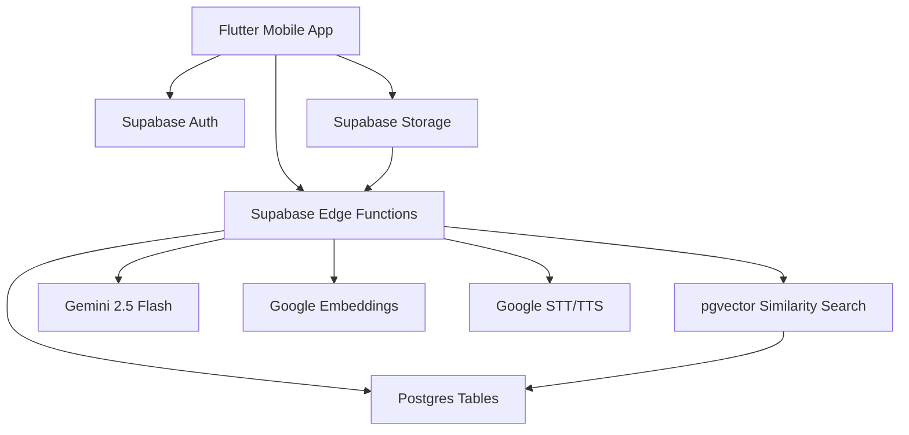

# Sayved Sharp MVP - Technical Architecture Document

## 1. Product Intent

Sayved is a mobile-first Christian AI guidance app. Users choose one trusted pastor, ask a faith question by text or voice, and receive a fast answer grounded in that pastor's published teachings, with scripture and sermon references.

The MVP must feel native on iPhone from day one, because the Flutter build will later be wrapped or shipped as a mobile app. The architecture therefore favors a polished Flutter client, lightweight Supabase backend services, and a small but trustworthy RAG pipeline.

## 2. MVP Scope

### Screens

1. Home / Landing
2. New Conversation
3. AI Conversation
4. Pastor Profile
5. Scripture / References
6. Today's Devotion
7. Profile

### Core Capabilities

- Three pastors only for MVP.
- Text prompt input.
- Voice prompt input via Google Speech-to-Text.
- AI answer generation with Gemini 2.5 Flash.
- Retrieval from Supabase Postgres + pgvector.
- Scripture references and sermon references.
- Text-to-speech playback using Google TTS.
- Daily devotion.
- Saved conversations.

### Explicitly Out Of Scope

- Payments, subscriptions, events, community, social features.
- Multiple AI models exposed to users.
- Pastor comparison as a real feature. If shown in UI, keep disabled or remove before launch.
- Full analytics dashboard.
- Notifications beyond static profile settings.
- Public sharing pages.

## 3. Architecture Overview



## 4. Frontend Architecture

### Framework

- Flutter.
- Target iOS-first mobile UX.
- Responsive support for common iPhone sizes from iPhone SE through Pro Max.
- Android should work, but visual QA is iPhone-first.

### State Management

Recommended: Riverpod.

Use providers for:

- Auth/session state.
- Selected pastor.
- Conversation draft.
- Active conversation stream.
- Daily devotion.
- Saved items.

Keep state local and simple for MVP. Avoid complex app-wide stores unless the codebase starts demanding it.

### Navigation

Recommended: `go_router`.

Routes:

- `/` - Home
- `/conversation/new` - New Conversation
- `/conversation/:conversationId` - AI Conversation
- `/pastors/:pastorId` - Pastor Profile
- `/scripture/:referenceId` - Scripture / Reference
- `/devotion/today` - Today's Devotion
- `/profile` - Profile

Use native-feeling transitions:

- Push from pastor/profile/reference cards.
- Bottom sheet for quick pastor selector only if needed.
- Preserve bottom tab bar on Home, Chats, Devotions, Profile.
- Hide bottom tab bar on full-focus detail routes if the screen needs breathing room.

### UI Composition

Use feature folders:

```text
lib/
  app/
    router.dart
    theme.dart
  features/
    home/
    conversations/
    pastors/
    scripture/
    devotions/
    profile/
  shared/
    widgets/
    services/
    models/
```

## 5. Backend Architecture

### Supabase Components

- Postgres for canonical data.
- pgvector for embeddings.
- Supabase Auth for optional MVP accounts.
- Supabase Storage for pastor images, sermon audio, and devotion imagery.
- Edge Functions for all AI, embedding, STT, TTS, and RAG orchestration.

The Flutter app must never call Gemini or Google AI APIs directly. Keep all AI keys server-side in Edge Function secrets.

### Edge Functions

Required functions:

- `create-conversation`
- `send-message`
- `generate-devotion`
- `resolve-scripture-reference`
- `transcribe-audio`
- `synthesize-answer-audio`
- `save-conversation`

Optional internal functions:

- `ingest-sermon`
- `embed-content-chunk`
- `score-creator-content`

## 6. RAG Answer Flow

1. User selects pastor.
2. User submits question.
3. Edge Function normalizes prompt and identifies intent.
4. Function embeds prompt using Google Embeddings.
5. Function retrieves top sermon chunks for selected pastor only.
6. Function retrieves known scripture references related to those chunks.
7. Function builds grounded system prompt.
8. Gemini 2.5 Flash generates answer.
9. Function validates citations and removes unsupported claims.
10. Response, citations, and retrieval metadata are stored.
11. Flutter renders answer with scripture chips, sermon references, save/share/listen actions.

## 7. Performance Targets

- Home cold load: under 2.0s after app startup.
- New Conversation ready: under 1.0s after route push.
- Typical AI answer: under 3.0s where possible.
- TTS playback ready: under 2.0s after tap.
- Message send interaction feedback: under 100ms.

If full answer generation exceeds 3 seconds, show a graceful streaming/loading state:

- "Searching Pastor Poju's teachings..."
- "Grounding answer in scripture..."
- "Preparing answer..."

## 8. Security

- Store AI keys only in Supabase Edge Function secrets.
- Enable row-level security on all user-owned tables.
- Public pastor/devotion data can be read by all authenticated or anonymous users.
- User conversations are private to the owning user or anonymous device id.
- Validate every pastor id server-side.
- Do not allow client-supplied source citations without backend verification.

## 9. Observability

Log these events server-side:

- `conversation_started`
- `message_sent`
- `rag_retrieval_completed`
- `answer_generated`
- `answer_failed`
- `scripture_opened`
- `tts_requested`
- `devotion_opened`

For MVP, store operational logs in a simple `app_events` table. Avoid adding a dashboard until after beta feedback.

## 10. Mobile Native Feel Requirements

- Respect iOS safe areas and dynamic island spacing.
- Bottom tab bar uses blurred/translucent white surface.
- Input bar is fixed above bottom tab bar in chat.
- Use haptics on send, select pastor, save, and primary actions.
- Use native-feeling spring animations, 180-260ms.
- Avoid web-like landing page sections. Every screen should feel like an app screen.

## 11. Launch Readiness Checklist

- Seven core screens implemented.
- Three pastors seeded.
- At least 30 sermon/source chunks per pastor for beta.
- Scripture reference page opens from every scripture chip.
- Chat answers include at least one scripture reference when relevant.
- TTS works for the latest AI response.
- Voice prompt transcription works on physical device.
- RLS tested for saved conversations.
- iPhone SE and iPhone Pro Max visual QA complete.
