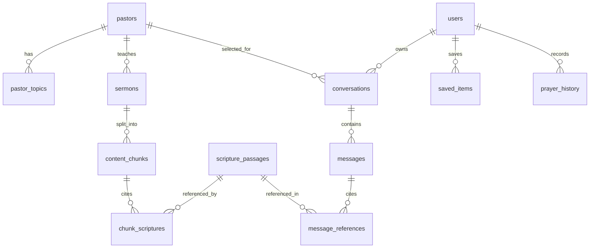

# Sayved Sharp MVP - Database Design Document

## 1. Database Platform

Use Supabase Postgres with pgvector enabled.

```sql
create extension if not exists vector;
```

The database has four main data groups:

- Public content: pastors, topics, sermons, scripture.
- RAG content: chunks and embeddings.
- User content: conversations, messages, saves, prayer history.
- Operations: events, generation logs, feedback.

## 2. Entity Overview



## 3. Tables

### `pastors`

Stores the three MVP pastors.

| Column | Type | Notes |
| --- | --- | --- |
| `id` | uuid pk | Stable id |
| `slug` | text unique | `pastor-poju` |
| `display_name` | text | `Pastor Poju` |
| `subtitle` | text | `Faith & Grace` |
| `short_intro` | text | Trust-building intro |
| `portrait_url` | text | Supabase Storage URL |
| `theme_label` | text | Optional UI label |
| `sort_order` | int | Home order |
| `is_active` | bool | Hide/show |
| `created_at` | timestamptz | Default now |

### `topics`

Canonical topic list.

| Column | Type | Notes |
| --- | --- | --- |
| `id` | uuid pk | Stable id |
| `name` | text unique | Faith, Purpose, Prayer |
| `sort_order` | int | UI ordering |

### `pastor_topics`

Many-to-many pastor topic mapping.

| Column | Type | Notes |
| --- | --- | --- |
| `pastor_id` | uuid fk | `pastors.id` |
| `topic_id` | uuid fk | `topics.id` |

### `sermons`

Represents source material used by RAG.

| Column | Type | Notes |
| --- | --- | --- |
| `id` | uuid pk | Stable id |
| `pastor_id` | uuid fk | Required |
| `title` | text | Sermon/conference title |
| `source_type` | text | `sermon`, `conference`, `bible_teaching` |
| `source_url` | text | Optional public URL |
| `audio_url` | text | Optional stored audio |
| `published_at` | date | Optional |
| `duration_seconds` | int | Optional |
| `transcript_status` | text | `pending`, `ready`, `failed` |
| `created_at` | timestamptz | Default now |

### `content_chunks`

Chunks used for semantic retrieval.

| Column | Type | Notes |
| --- | --- | --- |
| `id` | uuid pk | Stable id |
| `sermon_id` | uuid fk | Required |
| `pastor_id` | uuid fk | Denormalized for filtering |
| `chunk_index` | int | Source order |
| `content` | text | 300-800 tokens recommended |
| `start_seconds` | int | Optional |
| `end_seconds` | int | Optional |
| `embedding` | vector(768) | Match Google embedding dimension used |
| `quality_score` | numeric | Creator scoring result |
| `is_approved` | bool | Only approved chunks retrieved |
| `created_at` | timestamptz | Default now |

Recommended index:

```sql
create index content_chunks_embedding_idx
on content_chunks
using ivfflat (embedding vector_cosine_ops)
with (lists = 100);

create index content_chunks_pastor_idx
on content_chunks (pastor_id, is_approved);
```

### `scripture_passages`

Normalized Bible references.

| Column | Type | Notes |
| --- | --- | --- |
| `id` | uuid pk | Stable id |
| `reference` | text unique | `Philippians 4:6-7` |
| `book` | text | `Philippians` |
| `chapter_start` | int | 4 |
| `verse_start` | int | 6 |
| `chapter_end` | int | 4 |
| `verse_end` | int | 7 |
| `translation` | text | MVP default |
| `passage_text` | text | Full passage if licensed/allowed |
| `created_at` | timestamptz | Default now |

### `chunk_scriptures`

Scriptures detected or manually attached to source chunks.

| Column | Type | Notes |
| --- | --- | --- |
| `chunk_id` | uuid fk | Required |
| `scripture_id` | uuid fk | Required |
| `confidence` | numeric | 0-1 |

### `profiles`

User profile extension for Supabase Auth.

| Column | Type | Notes |
| --- | --- | --- |
| `id` | uuid pk | Same as `auth.users.id` |
| `preferred_pastor_id` | uuid fk | Optional |
| `display_name` | text | Optional |
| `notifications_enabled` | bool | Default false |
| `created_at` | timestamptz | Default now |

### `anonymous_devices`

Supports no-login MVP usage.

| Column | Type | Notes |
| --- | --- | --- |
| `id` | uuid pk | Device/session id |
| `install_id` | text unique | Generated client-side |
| `preferred_pastor_id` | uuid fk | Optional |
| `created_at` | timestamptz | Default now |

### `conversations`

| Column | Type | Notes |
| --- | --- | --- |
| `id` | uuid pk | Stable id |
| `user_id` | uuid fk nullable | Auth user |
| `anonymous_device_id` | uuid fk nullable | Anonymous user |
| `pastor_id` | uuid fk | Selected pastor |
| `title` | text | Generated from first prompt |
| `is_saved` | bool | Default false |
| `created_at` | timestamptz | Default now |
| `updated_at` | timestamptz | Auto update |

### `messages`

| Column | Type | Notes |
| --- | --- | --- |
| `id` | uuid pk | Stable id |
| `conversation_id` | uuid fk | Required |
| `role` | text | `user`, `assistant`, `system` |
| `content` | text | Message body |
| `audio_url` | text | TTS output if generated |
| `latency_ms` | int | Assistant only |
| `created_at` | timestamptz | Default now |

### `message_references`

Stores citations shown under AI answers.

| Column | Type | Notes |
| --- | --- | --- |
| `id` | uuid pk | Stable id |
| `message_id` | uuid fk | Assistant message |
| `reference_type` | text | `scripture`, `sermon`, `chunk` |
| `scripture_id` | uuid fk nullable | If scripture |
| `sermon_id` | uuid fk nullable | If sermon |
| `chunk_id` | uuid fk nullable | If chunk |
| `label` | text | Display label |
| `reason` | text | Why referenced |
| `sort_order` | int | UI order |

### `daily_devotions`

| Column | Type | Notes |
| --- | --- | --- |
| `id` | uuid pk | Stable id |
| `date` | date unique | One per day |
| `title` | text | Devotion title |
| `reading_time_minutes` | int | 2-5 |
| `scripture_id` | uuid fk | Today's scripture |
| `reflection` | text | Main body |
| `prayer` | text | Closing prayer |
| `created_at` | timestamptz | Default now |

### `saved_items`

| Column | Type | Notes |
| --- | --- | --- |
| `id` | uuid pk | Stable id |
| `user_id` | uuid fk nullable | Auth user |
| `anonymous_device_id` | uuid fk nullable | Anonymous |
| `item_type` | text | `conversation`, `message`, `devotion`, `scripture` |
| `item_id` | uuid | Referenced id |
| `created_at` | timestamptz | Default now |

### `prayer_history`

| Column | Type | Notes |
| --- | --- | --- |
| `id` | uuid pk | Stable id |
| `user_id` | uuid fk nullable | Auth user |
| `anonymous_device_id` | uuid fk nullable | Anonymous |
| `conversation_id` | uuid fk nullable | Optional |
| `prompt` | text | Prayer/question text |
| `pastor_id` | uuid fk | Selected pastor |
| `created_at` | timestamptz | Default now |

### `app_events`

Lightweight beta analytics and debugging.

| Column | Type | Notes |
| --- | --- | --- |
| `id` | uuid pk | Stable id |
| `event_name` | text | Required |
| `user_id` | uuid nullable | Optional |
| `anonymous_device_id` | uuid nullable | Optional |
| `properties` | jsonb | Event metadata |
| `created_at` | timestamptz | Default now |

## 4. RLS Policy Direction

- `pastors`, `topics`, `pastor_topics`, `sermons`, `scripture_passages`, and approved `daily_devotions`: public read.
- `content_chunks`: no direct client read. Edge Functions only.
- `conversations`, `messages`, `saved_items`, `prayer_history`: readable only by owning user or anonymous device.
- Inserts into user-owned tables must validate ownership.

## 5. Seed Data

MVP pastors:

- Pastor Poju - Faith & Grace
- Pastor Ita - Wisdom & Living
- Pastor Mike - Hope & Strength

Pastor Poju topics:

- Faith
- Purpose
- Prayer
- Marriage
- Business
- Leadership

Minimum beta content:

- 3 pastors.
- 6 topics.
- 10 source items per pastor.
- 30 approved chunks per pastor.
- 20 normalized scripture passages.
- 7 daily devotions.
