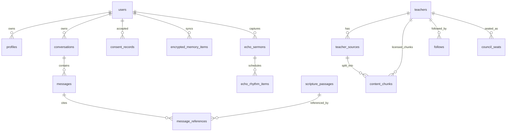

# Sayved Sharp MVP - Database Design Document

## 1. Database Platform

Use Supabase Postgres with pgvector enabled.

```sql
create extension if not exists vector;
```

The database stores public catalog, source metadata, conversations, consent, and operational events. It must not become the plaintext home of the user's Memory. Memory is local encrypted data first; any future sync must be end-to-end encrypted or confidential-compute based.

## 2. Data Domains

- Identity and consent.
- Teacher catalog and verification.
- Source routing and licensed content.
- Conversation and citations.
- Scripture and Bible foundations.
- The Well and devotions.
- Memory metadata and encrypted sync envelopes.
- Echo sermon capture metadata.
- Safety, crisis, and compliance events.

## 3. Entity Overview



## 4. Core Tables

### `profiles`

| Column | Type | Notes |
| --- | --- | --- |
| `id` | uuid pk | Same as `auth.users.id` |
| `display_name` | text | Optional |
| `preferred_teacher_id` | uuid fk nullable | Optional focus |
| `minor_mode_enabled` | bool | Default false |
| `notifications_enabled` | bool | Default false |
| `created_at` | timestamptz | Default now |

### `anonymous_devices`

Supports no-account first conversation.

| Column | Type | Notes |
| --- | --- | --- |
| `id` | uuid pk | Device/session id |
| `install_id` | text unique | Generated client-side |
| `preferred_teacher_id` | uuid fk nullable | Optional |
| `created_at` | timestamptz | Default now |

### `consent_records`

| Column | Type | Notes |
| --- | --- | --- |
| `id` | uuid pk | Stable id |
| `user_id` | uuid nullable | Auth user |
| `anonymous_device_id` | uuid nullable | Anonymous |
| `consent_type` | text | `privacy`, `terms`, `ai_disclosure`, `notifications`, `memory`, `frontier_escalation` |
| `version` | text | Document version |
| `accepted` | bool | Required |
| `accepted_at` | timestamptz | Default now |
| `ip_hash` | text | Optional |
| `user_agent` | text | Optional |

## 5. Teacher Catalog

### `teachers`

Replaces the old `pastors` table. It supports living pastors, estate voices, public-domain historic figures, and local Echo pastors.

| Column | Type | Notes |
| --- | --- | --- |
| `id` | uuid pk | Stable id |
| `slug` | text unique | `pastor-chris-oyakhilome` |
| `display_name` | text | `Pastor Chris Oyakhilome` |
| `honorific` | text | Pastor, Prophet, Bishop, etc. |
| `subtitle` | text | Ministry/theme label |
| `teacher_type` | text | `living`, `estate`, `historic_public_domain`, `local_pastor` |
| `verification_status` | text | `verified`, `unverified`, `estate`, `historic_public_domain`, `thin_catalog`, `inactive` |
| `affiliation_label` | text | `Verified`, `Not yet affiliated with Sayved` |
| `ministry_name` | text | Optional |
| `portrait_url` | text | Supabase Storage or remote |
| `official_site_url` | text | Optional |
| `public_feed_url` | text | RSS/podcast |
| `official_youtube_url` | text | Optional |
| `license_status` | text | `none`, `pending`, `active`, `revoked` |
| `deep_rag_allowed` | bool | Must be false unless licensed or public domain |
| `disputation_allowed` | bool | Public-domain or verified only |
| `sort_order` | int | UI order |
| `is_active` | bool | Hide/show |
| `created_at` | timestamptz | Default now |

Narrow MVP seed:

| Slot | Teacher | Required status at launch |
| --- | --- | --- |
| 1 | Prophet T.B. Joshua | `estate`, `deep_rag_allowed=false` unless SCOAN/estate license exists |
| 2 | Pastor Chris Oyakhilome | `unverified`, `deep_rag_allowed=false` unless Christ Embassy license exists |
| 3 | Pastor E.A. Adeboye | `unverified`, `deep_rag_allowed=false` unless RCCG/license exists |
| 4 | Archbishop Benson Idahosa | `estate`, `deep_rag_allowed=false` unless estate/ministry license exists |

### `topics`

| Column | Type | Notes |
| --- | --- | --- |
| `id` | uuid pk | Stable id |
| `name` | text unique | Faith, Prayer, Purpose |
| `sort_order` | int | UI ordering |

### `teacher_topics`

| Column | Type | Notes |
| --- | --- | --- |
| `teacher_id` | uuid fk | `teachers.id` |
| `topic_id` | uuid fk | `topics.id` |

### `follows`

| Column | Type | Notes |
| --- | --- | --- |
| `id` | uuid pk | Stable id |
| `user_id` | uuid nullable | Auth user |
| `anonymous_device_id` | uuid nullable | Anonymous |
| `teacher_id` | uuid fk | Followed teacher |
| `created_at` | timestamptz | Default now |

### `council_seats`

| Column | Type | Notes |
| --- | --- | --- |
| `id` | uuid pk | Stable id |
| `user_id` | uuid nullable | Auth user |
| `anonymous_device_id` | uuid nullable | Anonymous |
| `teacher_id` | uuid fk | Seated voice |
| `seat_index` | int | 1-7 |
| `created_at` | timestamptz | Default now |

## 6. Sources And RAG

### `teacher_sources`

Represents sermons, books, podcast episodes, YouTube videos, devotionals, or historic writings.

| Column | Type | Notes |
| --- | --- | --- |
| `id` | uuid pk | Stable id |
| `teacher_id` | uuid fk | Required |
| `title` | text | Source title |
| `source_type` | text | `sermon`, `conference`, `podcast`, `book`, `devotional`, `historic_work`, `youtube` |
| `source_url` | text | Official URL |
| `embed_url` | text | Official embed/feed URL |
| `published_at` | date | Optional |
| `duration_seconds` | int | Optional |
| `rights_status` | text | `public_domain`, `official_public_route`, `licensed`, `unknown`, `blocked` |
| `transcript_status` | text | `none`, `pending`, `ready`, `blocked` |
| `ingestion_allowed` | bool | True only for licensed/public-domain sources |
| `created_at` | timestamptz | Default now |

### `content_chunks`

Only for licensed or public-domain source material.

| Column | Type | Notes |
| --- | --- | --- |
| `id` | uuid pk | Stable id |
| `source_id` | uuid fk | `teacher_sources.id` |
| `teacher_id` | uuid fk | Denormalized |
| `chunk_index` | int | Source order |
| `content` | text | 300-800 tokens recommended |
| `start_seconds` | int | Optional |
| `end_seconds` | int | Optional |
| `embedding` | vector(768) | Match Google embedding dimension |
| `quality_score` | numeric | Creator scoring result |
| `safety_score` | numeric | Safety score |
| `is_approved` | bool | Only approved chunks retrieved |
| `created_at` | timestamptz | Default now |

Recommended indexes:

```sql
create index content_chunks_embedding_idx
on content_chunks
using ivfflat (embedding vector_cosine_ops)
with (lists = 100);

create index content_chunks_teacher_idx
on content_chunks (teacher_id, is_approved);
```

### `teacher_requests`

Demand signal for unverified teachers.

| Column | Type | Notes |
| --- | --- | --- |
| `id` | uuid pk | Stable id |
| `teacher_id` | uuid fk | Requested teacher |
| `user_id` | uuid nullable | Optional |
| `anonymous_device_id` | uuid nullable | Optional |
| `context` | text | Optional user-safe reason |
| `created_at` | timestamptz | Default now |

## 7. Scripture And Foundations

### `scripture_passages`

| Column | Type | Notes |
| --- | --- | --- |
| `id` | uuid pk | Stable id |
| `reference` | text unique | `Philippians 4:6-7` |
| `book` | text | `Philippians` |
| `chapter_start` | int | 4 |
| `verse_start` | int | 6 |
| `chapter_end` | int | 4 |
| `verse_end` | int | 7 |
| `translation` | text | Licensed/default |
| `passage_text` | text | Store only if rights allow |
| `created_at` | timestamptz | Default now |

### `chunk_scriptures`

| Column | Type | Notes |
| --- | --- | --- |
| `chunk_id` | uuid fk | Required |
| `scripture_id` | uuid fk | Required |
| `confidence` | numeric | 0-1 |

## 8. Conversation

### `conversations`

| Column | Type | Notes |
| --- | --- | --- |
| `id` | uuid pk | Stable id |
| `user_id` | uuid nullable | Auth user |
| `anonymous_device_id` | uuid nullable | Anonymous |
| `title` | text | Generated from first prompt |
| `mode` | text | `director`, `teacher_focus`, `council`, `compare`, `disputation` |
| `active_teacher_id` | uuid nullable | Focused teacher |
| `is_saved` | bool | Default false |
| `created_at` | timestamptz | Default now |
| `updated_at` | timestamptz | Auto update |

### `messages`

| Column | Type | Notes |
| --- | --- | --- |
| `id` | uuid pk | Stable id |
| `conversation_id` | uuid fk | Required |
| `role` | text | `user`, `director`, `system` |
| `content` | text | Message body |
| `rendered_mode` | text | `director`, `teacher_route`, `council_synthesis`, `crisis` |
| `audio_url` | text | Director TTS output |
| `latency_ms` | int | Assistant only |
| `created_at` | timestamptz | Default now |

### `message_references`

| Column | Type | Notes |
| --- | --- | --- |
| `id` | uuid pk | Stable id |
| `message_id` | uuid fk | Director message |
| `reference_type` | text | `scripture`, `source`, `chunk`, `memory`, `official_route` |
| `scripture_id` | uuid nullable | If scripture |
| `teacher_id` | uuid nullable | If teacher/source |
| `source_id` | uuid nullable | If source |
| `chunk_id` | uuid nullable | If licensed chunk |
| `label` | text | Display label |
| `reason` | text | Why referenced |
| `verification_status` | text | Snapshot |
| `sort_order` | int | UI order |

## 9. The Well And Devotions

### `well_items`

| Column | Type | Notes |
| --- | --- | --- |
| `id` | uuid pk | Stable id |
| `date` | date | Day shown |
| `item_type` | text | `scripture`, `reflection`, `teacher_source`, `memory_thread`, `devotion` |
| `title` | text | Display title |
| `body` | text | Optional |
| `scripture_id` | uuid nullable | Optional |
| `teacher_id` | uuid nullable | Optional |
| `source_id` | uuid nullable | Optional |
| `sort_order` | int | Finite ordering |
| `is_sunday_silent` | bool | Hide feed items on Sunday if needed |
| `created_at` | timestamptz | Default now |

### `daily_devotions`

| Column | Type | Notes |
| --- | --- | --- |
| `id` | uuid pk | Stable id |
| `date` | date unique | One per day |
| `title` | text | Devotion title |
| `reading_time_minutes` | int | 2-5 |
| `scripture_id` | uuid fk | Today's scripture |
| `reflection` | text | Main body |
| `prayer` | text | Closing prayer |
| `created_at` | timestamptz | Default now |

## 10. Memory And My Walk

### `encrypted_memory_items`

For future sync only. Local device storage is canonical for MVP.

| Column | Type | Notes |
| --- | --- | --- |
| `id` | uuid pk | Stable id |
| `user_id` | uuid nullable | Auth user |
| `anonymous_device_id` | uuid nullable | Anonymous |
| `ciphertext` | bytea | Encrypted item |
| `nonce` | bytea | AES-GCM nonce |
| `key_version` | text | User-held key version |
| `local_created_at` | timestamptz | Source timestamp |
| `synced_at` | timestamptz | Default now |

Local plaintext memory shape:

```json
{
  "id": "uuid",
  "type": "theme|fact|strength|spiritual_marker|commitment|self_correction",
  "content": "fear of being behind",
  "emotional_weight": 0.82,
  "salience": 0.76,
  "source_message_id": "uuid",
  "privacy_flag": "private",
  "created_at": "2026-07-05T20:00:00Z",
  "updated_at": "2026-07-05T20:00:00Z"
}
```

### `autobiography_exports`

| Column | Type | Notes |
| --- | --- | --- |
| `id` | uuid pk | Stable id |
| `user_id` | uuid nullable | Owner |
| `anonymous_device_id` | uuid nullable | Owner |
| `encrypted_export_url` | text | Optional encrypted artifact |
| `day_count` | int | 90, 180, 365 |
| `created_at` | timestamptz | Default now |

## 11. Echo

### `echo_sermons`

| Column | Type | Notes |
| --- | --- | --- |
| `id` | uuid pk | Stable id |
| `user_id` | uuid nullable | Owner |
| `anonymous_device_id` | uuid nullable | Owner |
| `church_name` | text | Optional |
| `local_pastor_name` | text | Optional |
| `captured_on` | date | Sunday |
| `transcript_ciphertext` | bytea nullable | Encrypted if synced |
| `summary_ciphertext` | bytea nullable | Encrypted if synced |
| `created_at` | timestamptz | Default now |

### `echo_rhythm_items`

| Column | Type | Notes |
| --- | --- | --- |
| `id` | uuid pk | Stable id |
| `echo_sermon_id` | uuid fk | Required |
| `day_index` | int | 1-6, Monday-Saturday |
| `title` | text | Rhythm title |
| `body_ciphertext` | bytea nullable | Encrypted body if synced |
| `completed_at` | timestamptz nullable | Optional |

## 12. Safety And Events

### `crisis_events`

Never store raw crisis content.

| Column | Type | Notes |
| --- | --- | --- |
| `id` | uuid pk | Stable id |
| `user_id` | uuid nullable | Optional |
| `anonymous_device_id` | uuid nullable | Optional |
| `detected_level` | text | `low`, `medium`, `imminent` |
| `handoff_shown` | bool | Required |
| `resource_region` | text | Country/region |
| `created_at` | timestamptz | Default now |

### `app_events`

| Column | Type | Notes |
| --- | --- | --- |
| `id` | uuid pk | Stable id |
| `event_name` | text | Required |
| `user_id` | uuid nullable | Optional |
| `anonymous_device_id` | uuid nullable | Optional |
| `properties` | jsonb | Non-sensitive metadata |
| `created_at` | timestamptz | Default now |

## 13. RLS Direction

- `teachers`, `topics`, `teacher_topics`, approved `teacher_sources`, `scripture_passages`, public `well_items`, and approved `daily_devotions`: public read.
- `content_chunks`: no direct client read. Edge Functions only.
- `conversations`, `messages`, `follows`, `council_seats`, `consent_records`, `teacher_requests`, `echo_sermons`, `autobiography_exports`: owner read/write only.
- `encrypted_memory_items`: owner read/write only; server must never need plaintext.
- `crisis_events`: insert-only from client/function; no raw content.

## 14. Minimum Seed Data

- 4 teacher slots.
- 4 confirmed named teachers: T.B. Joshua, Pastor Chris Oyakhilome, Pastor E.A. Adeboye, Archbishop Benson Idahosa.
- Topics: Faith, Prayer, Purpose, Anxiety, Wisdom, Healing, Leadership, Family, Business, Hope.
- At least 20 scripture references.
- 7 daily devotions.
- Phase A source routes for each active unverified/estate teacher: official site, official YouTube, podcast/feed, books/library links where available.
- No content chunks for unverified/estate teachers unless licensing is documented.
