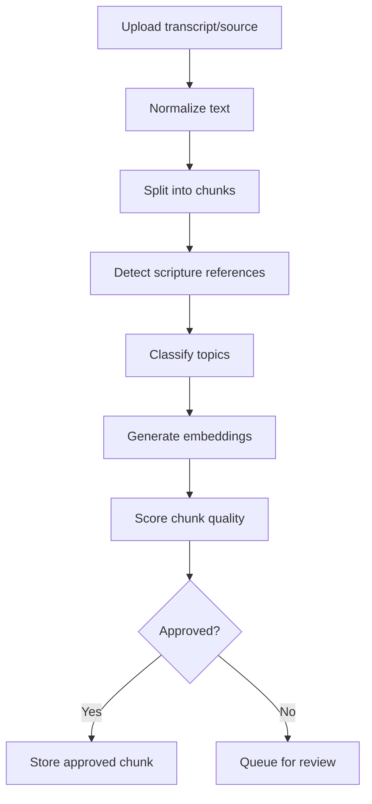

# Sayved Sharp MVP - Creator Scoring Engine Specification

## 1. Purpose

The creator scoring engine ranks pastor source material before it is used in AI answers. Its goal is not to judge the pastor. Its goal is to decide which sermon chunks are clear, relevant, grounded, and safe enough for retrieval.

For MVP, this can run offline during content ingestion and store scores on `content_chunks.quality_score`.

## 2. Inputs

Per source item:

- Pastor id.
- Sermon/conference/Bible teaching title.
- Transcript text.
- Optional audio timestamp metadata.
- Optional source URL.
- Detected scripture references.
- Manual approval status.

Per chunk:

- Chunk text.
- Source metadata.
- Embedding.
- Detected topics.
- Detected scripture references.

## 3. Scoring Dimensions

Each chunk receives a 0-100 score.

| Dimension | Weight | Description |
| --- | ---: | --- |
| Source clarity | 20 | Chunk is understandable without excessive missing context |
| Biblical grounding | 20 | Contains scripture, biblical reasoning, or doctrinal framing |
| Topic usefulness | 15 | Useful for common user questions |
| Pastor specificity | 15 | Reflects this pastor's teaching voice and emphasis |
| Retrieval quality | 15 | Chunk is semantically focused, not too broad |
| Safety and sensitivity | 10 | Avoids harmful, speculative, or high-risk advice |
| Freshness/completeness | 5 | Source metadata is complete and usable |

## 4. Score Formula

```text
quality_score =
  source_clarity * 0.20 +
  biblical_grounding * 0.20 +
  topic_usefulness * 0.15 +
  pastor_specificity * 0.15 +
  retrieval_quality * 0.15 +
  safety_score * 0.10 +
  freshness_score * 0.05
```

All dimensions are normalized from 0 to 100.

## 5. Approval Thresholds

- 85-100: Excellent. Use freely in retrieval.
- 70-84: Good. Use in retrieval.
- 55-69: Borderline. Keep for review; do not retrieve by default.
- 0-54: Reject or require manual edit.

Set:

```text
is_approved = quality_score >= 70 and safety_score >= 80
```

## 6. Safety Flags

Flag chunks for manual review when they include:

- Medical diagnosis or treatment advice.
- Financial promises or guaranteed outcomes.
- Marriage/domestic conflict advice that could endanger someone.
- Political persuasion.
- End-times speculation presented as certainty.
- Attacks on individuals or groups.
- Unclear transcript text.
- Missing attribution.

## 7. Topic Classification

MVP topic set:

- Faith
- Purpose
- Prayer
- Marriage
- Business
- Leadership
- Anxiety
- Fear
- Wisdom
- Devotion

Each chunk may have up to 3 topics. Store topic tags in a join table later if needed; for MVP, a `topics text[]` column or JSON metadata is acceptable.

## 8. Ingestion Workflow



## 9. Chunking Rules

- Target 300-800 tokens per chunk.
- Preserve paragraph boundaries where possible.
- Keep scripture explanations together with the scripture reference.
- Store timestamps when available.
- Avoid chunks that are only introductions, jokes, ads, or announcements.

## 10. Retrieval Boosting

At query time, combine semantic similarity with chunk quality.

```text
retrieval_score = semantic_similarity * 0.75 + normalized_quality_score * 0.25
```

Boost:

- Same topic as detected prompt intent: +0.05.
- Chunk contains scripture: +0.03.
- Chunk has timestamp/source URL: +0.02.

Penalize:

- Chunk older than others only if same topic has stronger newer sources: -0.02.
- Borderline manual-review content: excluded.

## 11. Output Stored On Chunk

```json
{
  "quality_score": 86,
  "score_breakdown": {
    "source_clarity": 90,
    "biblical_grounding": 88,
    "topic_usefulness": 84,
    "pastor_specificity": 82,
    "retrieval_quality": 85,
    "safety_score": 95,
    "freshness_score": 70
  },
  "topics": ["Faith", "Prayer", "Anxiety"],
  "safety_flags": [],
  "is_approved": true
}
```

## 12. Beta Review Process

Before launch:

- Review top 20 chunks per pastor.
- Review all chunks used by the first 50 beta answers.
- Add manual blocklist for weak or risky chunks.
- Collect feedback on whether answers sound like the selected pastor's teaching emphasis.
