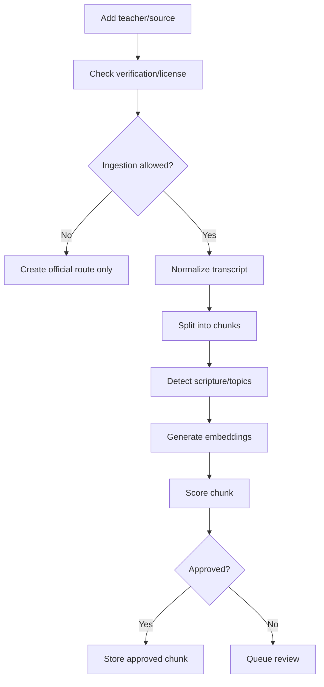

# Sayved Sharp MVP - Creator Scoring Engine Specification

## 1. Purpose

The scoring engine decides what source material can be trusted by Sayved. It does not judge a pastor's ministry. It decides whether a source, chunk, quote, or official route is clear, lawful, grounded, safe, and useful enough for the Director to use.

For the narrow MVP, scoring has two layers:

- Legal/verification gate: whether Sayved may use the material deeply at all.
- Quality/retrieval score: how useful approved licensed/public-domain material is.

The legal gate always wins. A brilliant unlicensed transcript still cannot be ingested.

## 2. Source Classes

| Class | Deep RAG | Official routing | Disputation | Notes |
| --- | --- | --- | --- | --- |
| Verified living teacher | Yes | Yes | Yes, if topic allowed | Licensed/affiliated catalog |
| Unverified living teacher | No | Yes | No | Public facts, official feeds, brief attributed quotes |
| Estate voice | No | Yes | No | Treat like unverified until estate license exists |
| Historic public domain | Yes | Yes | Yes | Public-domain writings |
| Thin catalog | No | Limited | No | Admit gap; never guess |
| Blocked/takedown | No | No | No | Remove promptly |

Narrow MVP starting assumptions:

- T.B. Joshua: estate/source-only unless licensed.
- Pastor Chris Oyakhilome: unverified/source-only unless licensed.
- Pastor E.A. Adeboye: unverified/source-only unless licensed.
- Archbishop Benson Idahosa: estate/source-only unless licensed.

## 3. Inputs

Per teacher:

- Verification status.
- License status.
- Ministry/estate relationship.
- Official site/feed/channel URLs.
- Takedown status.
- Allowed usage class.

Per source:

- Title.
- Source type.
- Official URL.
- Rights status.
- Transcript availability.
- License proof.
- Publication date.
- Detected scripture references.
- Manual approval status.

Per chunk, only when ingestion is allowed:

- Chunk text.
- Source metadata.
- Embedding.
- Topics.
- Detected scripture references.
- Timestamp.

## 4. Legal Gate

Before scoring content quality:

```text
ingestion_allowed =
  teacher.verification_status in ["verified", "historic_public_domain"]
  and source.rights_status in ["licensed", "public_domain"]
  and source.takedown_status != "blocked"
```

If `ingestion_allowed=false`, do not create `content_chunks`. Create or update `teacher_sources` for official routing only.

## 5. Chunk Scoring Dimensions

Each approved chunk receives a 0-100 score.

| Dimension | Weight | Description |
| --- | ---: | --- |
| Source clarity | 15 | Understandable without missing context |
| Biblical grounding | 20 | Scripture, biblical reasoning, doctrinal framing |
| Topic usefulness | 15 | Useful for common user questions |
| Teacher specificity | 10 | Reflects this teacher's real emphasis |
| Retrieval focus | 15 | Semantically focused, not too broad |
| Safety and care | 15 | Avoids harmful, speculative, or high-risk counsel |
| Citation quality | 5 | Timestamp/title/source available |
| Rights confidence | 5 | License/public-domain metadata complete |

```text
quality_score =
  source_clarity * 0.15 +
  biblical_grounding * 0.20 +
  topic_usefulness * 0.15 +
  teacher_specificity * 0.10 +
  retrieval_focus * 0.15 +
  safety_and_care * 0.15 +
  citation_quality * 0.05 +
  rights_confidence * 0.05
```

## 6. Approval Thresholds

- 85-100: Excellent. Use freely in retrieval.
- 70-84: Good. Use in retrieval.
- 55-69: Review. Do not retrieve by default.
- 0-54: Reject or edit.

Set:

```text
is_approved = ingestion_allowed
  and quality_score >= 70
  and safety_and_care >= 80
  and rights_confidence >= 90
```

## 7. Safety Flags

Flag for manual review:

- Medical diagnosis or treatment advice.
- Mental-health crisis handling beyond pastoral encouragement.
- Financial guarantees or prosperity claims presented as certainty.
- Marriage/domestic conflict advice that could endanger someone.
- Political persuasion.
- End-times speculation presented as certainty.
- Attacks on people/groups.
- Unclear transcript.
- Missing attribution.
- Any apparent first-person simulation.

## 8. Topic Classification

MVP topics:

- Faith
- Prayer
- Purpose
- Anxiety
- Fear
- Healing
- Wisdom
- Leadership
- Family
- Business
- Hope
- Confession
- Waiting
- Calling

Each chunk may have up to 3 primary topics and 5 secondary tags.

## 9. Official Route Scoring

For unverified/estate teachers, score official routes instead of chunks.

| Dimension | Weight | Description |
| --- | ---: | --- |
| Officialness | 35 | Source is official ministry/channel/feed |
| Topic match | 25 | Fits the user's question |
| Safety | 20 | Does not route into harmful/sensational material |
| Accessibility | 10 | Plays well on mobile |
| Attribution clarity | 10 | Clearly names source and relationship |

Only show routes with score >= 70.

## 10. Ingestion Workflow



## 11. Retrieval Boosting

```text
retrieval_score = semantic_similarity * 0.70 + normalized_quality_score * 0.30
```

Boost:

- Same detected topic: +0.05.
- Scripture present: +0.03.
- Timestamp/source URL present: +0.02.
- Recently reviewed by human: +0.03.

Exclude:

- `deep_rag_allowed=false`.
- `is_approved=false`.
- `safety_and_care<80`.
- `rights_confidence<90`.

## 12. Stored Score Output

```json
{
  "quality_score": 88,
  "score_breakdown": {
    "source_clarity": 90,
    "biblical_grounding": 92,
    "topic_usefulness": 84,
    "teacher_specificity": 80,
    "retrieval_focus": 88,
    "safety_and_care": 95,
    "citation_quality": 85,
    "rights_confidence": 100
  },
  "topics": ["Faith", "Prayer", "Anxiety"],
  "safety_flags": [],
  "is_approved": true
}
```

## 13. Beta Review Process

Before launch:

- Confirm legal status for all four pastor slots.
- Review every official route for unverified/estate teachers.
- Review top 20 licensed/public-domain chunks per verified teacher.
- Test the system refuses to deep-RAG unverified and estate teachers.
- Test the system admits thin catalog gaps.
- Test the system never writes first-person pastor simulation.
